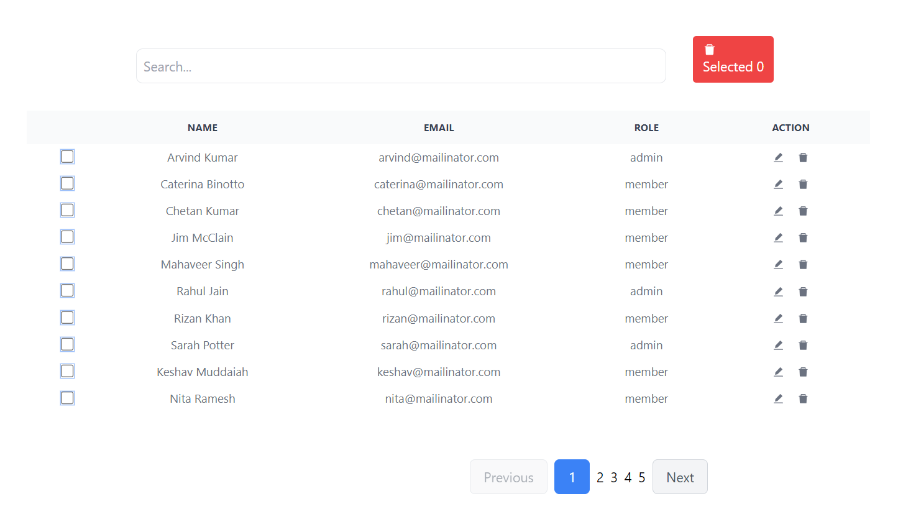

# Admin-DashBoard

An interface for admins to see and delete users.

# Hosted Link : https://admin-dashboard-1331.netlify.app/

# Features of the DashBoard

1. Search any field using search Bar

2. Delete any one or multi records at a time

3. Access to edit the field data and save it in each row

4. Checkboxes for each row, which when get selected highlights the row

5. Pagination with next , previous keys to show at max 10 records at a time
   .

   # Image:
   

# Steps to run this project locally:

1. Git Clone https://github.com/RajSahu1331/Admin-DashBoard.git

2. Install All Dependecies (npm install)

3. Start React + Vite App (npm run dev)

# Tech Stack

1. React JS
2. JavaScript
3. HTML
4. Tailwind CSS

# Learn More

You can learn more in the Create React App documentation.

To learn React, check out the React documentation.

Code Splitting
This section has moved here: https://facebook.github.io/create-react-app/docs/code-splitting

Analyzing the Bundle Size
This section has moved here: https://facebook.github.io/create-react-app/docs/analyzing-the-bundle-size

Making a Progressive Web App
This section has moved here: https://facebook.github.io/create-react-app/docs/making-a-progressive-web-app

Advanced Configuration
This section has moved here: https://facebook.github.io/create-react-app/docs/advanced-configuration

Deployment
This section has moved here: https://facebook.github.io/create-react-app/docs/deployment

npm run build fails to minify
This section has moved here: https://facebook.github.io/create-react-app/docs/troubleshooting#npm-run-build-fails-to-minify
